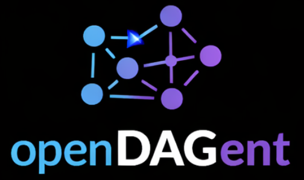

<p align="center">
  
</p>

<h1 align="center">openDAGent</h1>

<p align="center">
  <strong>Artifact-driven orchestration for long-running AI work.</strong><br>
  SQLite is the brain. Git is the history. Artifacts are the dependency boundary.
</p>

<p align="center">
  <a href="#why-not-an-org-chart">The Idea</a> ·
  <a href="#how-it-works">How It Works</a> ·
  <a href="#quickstart">Quickstart</a> ·
  <a href="#current-status">Status</a>
</p>

---

## The Problem With "AI Companies"

Most multi-agent frameworks today build **AI org charts**: a manager agent delegates to worker agents, who report back up the chain. There are departments, roles, and reporting lines — modeled straight from how human teams operate.

That design made sense for humans. It exists because of **human constraints**:
- People have limited working memory → need handoff documents and status meetings
- People need sleep and context-switching costs → async communication protocols
- People have specialization gaps → role definitions and escalation paths
- People can't be trusted blindly → approval hierarchies and sign-offs

**LLMs don't share these constraints.** They also have failure modes humans don't:
- They hallucinate under ambiguity, not under fatigue
- They lose coherence over long horizons, not over org boundaries
- They have no communication overhead between "agents" if state is explicit
- Their cost is per-token, not per-hour

Copying human org structure into an agentic system imports all the bureaucratic overhead **designed to compensate for human limits** — without getting the benefits, and while ignoring the actual LLM failure modes.

openDAGent is not a development tool. It is a general-purpose project orchestration engine. The same model applies to research projects, content production, data pipelines, infrastructure rollouts, business operations, or any other work where outputs depend on prior outputs.

---

## A Different Model

openDAGent doesn't model an organization. It models a **dependency graph**.

Work is broken into tasks. Each task declares:
- what artifacts it **needs** to run
- what artifacts it **produces** when done

A task becomes executable the moment its required artifacts exist with the right status. Nothing else gates it. No manager agent decides. No delegation chain. Just data readiness.

```
         ┌─────────────────┐
         │   product.brief │  ← artifact (file or structured value)
         └────────┬────────┘
                  │ required by
         ┌────────▼────────┐
         │  Design system  │  ← task (queued automatically when artifact is ready)
         └────────┬────────┘
                  │ produces
         ┌────────▼────────┐
         │  design.spec    │  ← artifact
         └─────────────────┘
```

This maps to how LLMs actually work: give them bounded, well-defined inputs → get reliable, auditable outputs. The DAG is the contract. Artifacts are the interface.

No prompt-chain spaghetti. No agent that "decides" whether to delegate. No hidden state living inside a context window.

---

## How It Works

### Core Architecture

| Layer | Role |
|---|---|
| **SQLite** | Runtime control plane — all state is here, explicit and queryable |
| **Git** | Source of truth for project work, artifact history, and rollback |
| **Capabilities** | What a task is allowed to read, write, and call — no unrestricted access |
| **Artifacts** | Versioned runtime objects connecting task outputs to task readiness |
| **Workers** | Isolated execution inside Git worktrees |

### Runtime Flow

```
Input (CLI / API / channel)
        │
        ▼
   Goal created
        │
        ▼
   Planner → Task definitions + artifact declarations → SQLite
        │
        ▼
   Scheduler checks artifact availability
        │
        ▼
   Ready tasks queued → Worker claims task
        │
        ▼
   Execution inside isolated Git worktree
        │
        ▼
   Outputs registered as artifacts → downstream tasks unlocked
```

### Artifact Types

Artifacts can be file-based or structured runtime values, regardless of domain:

```python
# File artifacts
{ "artifact_key": "report.draft",      "file_path": "output/draft_v1.md" }
{ "artifact_key": "dataset.cleaned",   "file_path": "data/cleaned.parquet" }
{ "artifact_key": "infra.plan",        "file_path": "terraform/plan.json" }

# Structured artifacts — decisions, approvals, computed values
{ "artifact_key": "scope.confirmed",   "value_json": {"confirmed": true} }
{ "artifact_key": "budget.approved",   "value_json": {"approved": true, "ceiling_usd": 5000} }
{ "artifact_key": "supplier.selected", "value_json": {"vendor": "Acme", "score": 0.91} }
```

Approvals, decisions, and planner outputs are first-class runtime objects — not side effects buried in conversation history. Any task that needs a human decision simply waits for the approval artifact to exist.

### Change Requests

When requirements change mid-execution, openDAGent handles it with a controlled flow:
1. Active work freezes
2. Impact analysis runs against the artifact graph
3. Affected tasks are replanned
4. Execution resumes from a clean checkpoint

No re-running everything from scratch. No silent divergence.

---

## Quickstart

### Requirements

- Python 3.11+
- Git

### Install

```bash
pip install openDAGent
```

### Configure

Generate a starter config file:

```bash
mkdir -p ~/.config/opendagent
openDAGent --init-config ~/.config/opendagent/config.yaml
```

Then edit the LLM section to point at your provider. The fastest path:

```yaml
llm:
  default_provider: openai
  default_model: gpt-4.1
  providers:
    - id: openai
      type: openai
      endpoint: https://api.openai.com/v1
      auth:
        type: api_key
        env_var: OPENAI_API_KEY
      models:
        - id: gpt-4.1
          role: strong_reasoning
          features: [vision, json_mode, long_context, code]
```

You can also add a provider interactively:

```bash
openDAGent --config ~/.config/opendagent/config.yaml --add-provider
```

For all supported providers (OpenAI, Anthropic, Gemini, Mistral, Azure, MiniMax,
Zhipu AI, Ollama, vLLM, …) and authentication methods, see
**[docs/llm-providers.md](docs/llm-providers.md)**.

A fully annotated config with every available option is in
**[config.example.yaml](config.example.yaml)**.

### Optional capabilities

Some capabilities require additional setup:

| Capability | Requirement | Setup guide |
|---|---|---|
| `browser_use` | Vision LLM + Playwright MCP | [docs/playwright-setup.md](docs/playwright-setup.md) |
| `web_search` | Brave API key or native LLM search | Set `BRAVE_API_KEY` env var |
| `generate_image` | Image generation model | Set `IMAGE_GEN_ENDPOINT` / `IMAGE_GEN_MODEL` / `IMAGE_GEN_API_KEY` |
| `code` / `test_code` / `code_review` / `debug_code` | opencode binary | `npm install -g opencode-ai` |

### Start

```bash
openDAGent --config ~/.config/opendagent/config.yaml
```

### Open the Web UI

```
http://127.0.0.1:8080/
```

The dashboard shows all projects, task DAGs, runtime states, task details, and artifact relationships.

### Runtime Flags

```bash
openDAGent --config path/to/config.yaml              # standard start
openDAGent --config ... --host 0.0.0.0 --port 9090   # override bind
openDAGent --config ... --no-web                     # headless mode
openDAGent --config ... --init-db-only               # bootstrap db and exit
openDAGent --init-config path/to/output.yaml         # write default config template
openDAGent --config ... --add-provider               # add an LLM provider interactively
```

---

## Current Status

**Done**
- Package, CLI, and repository bootstrap
- SQLite schema with required PRAGMAs
- Shared runtime models and artifact resolver
- Artifact-based task readiness and scheduler
- LLM client — OpenAI-compatible and Anthropic endpoints
- Ingress loop — detects new user messages, triggers planning
- Planner — creates tasks from goal state
- Worker loop — claims, executes, and records tasks
- `chat_response` capability — full message → LLM → reply pipeline
- Web UI: project chat, dashboard, DAG view, task detail

**Not yet implemented**
- Git repository and worktree isolation for task execution
- Capabilities beyond `chat_response` (file writes, web search, code execution, …)
- Structured plan output from planner (task graph from LLM response)
- Change management and approval flows
- Discord / email ingress channels

---

## Design Principles

- **Explicit over hidden** — runtime state lives in SQLite, not in a prompt.
- **Data-driven over authority-driven** — artifact availability gates tasks, not agent delegation.
- **Bounded execution** — capabilities define what a task can touch; nothing else is reachable.
- **Auditable by default** — artifact versions and task history are facts, not summaries.
- **Local-first** — runs on a single machine; distribute later if needed.

---

